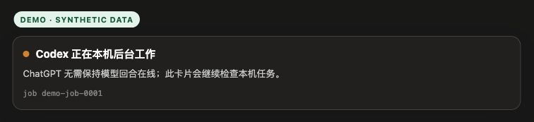
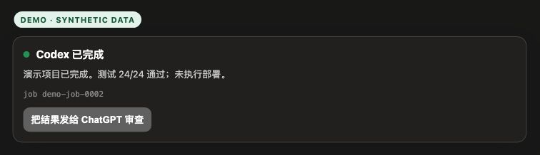
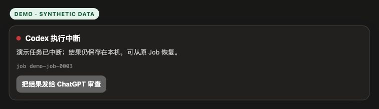

# ChatGPT Codex Bridge

让 ChatGPT 网页对话通过 OpenAI Secure MCP Tunnel 调度本机 Codex，并把
长任务状态安全地带回同一条 ChatGPT 对话。

[English reference](#english-reference)

## 页面演示

下面不是流程图，也不是已登录账号的截图。它们由仓库实际发布的
`WIDGET_HTML` 页面代码在本地浏览器中渲染，项目结果和 Job ID 均为合成
演示数据，因此不包含账号、设备名、真实路径、Tunnel profile、对话 ID、
浏览器书签或通知。

### 1. Codex 在后台执行

ChatGPT 回合不需要持续在线；页面卡片会继续读取本机 Job 状态。



### 2. Codex 完成并等待 ChatGPT 审查

任务进入终态后，卡片显示合成结果，并提供显式的“把结果发给 ChatGPT
审查”按钮。



### 3. 中断后的恢复入口

如果本机任务被停止或服务重启，卡片保留终态和恢复入口，不会伪装成
成功，也不会自动新建平行 Codex 任务。



演示页可由以下脚本从当前 Guard 源码重新生成：

```zsh
python3 scripts/docs/render-widget-demo.py \
  --state completed \
  --output /tmp/codex-widget-demo.html
```

## 它解决什么问题

- ChatGPT 负责理解目标、拆任务、检查结果和决定下一步。
- Secure MCP Tunnel 把 ChatGPT 的 MCP 调用转发到本机，不要求开放公网
  入站端口。
- Codex MCP Guard 负责固定工作区、权限预设、Job 状态和任务恢复。
- Codex App Server 在独立项目目录中创建可被 Codex 桌面端识别的项目和
  任务。
- 新项目第一条指令显式调用内置 `workspace-new-project` Skill，先建立
  `AGENTS.md`、README、spec、ADR、源码与项目记忆结构。

## 安全模型与信任边界

克隆或安装本仓库不会自动获得任何设备的执行权限。仓库不包含：

- Tunnel profile 或 runtime key；
- ChatGPT Developer MCP 授权；
- Codex 登录凭据；
- 本机 capability 签名密钥；
- 原始 Codex thread/job ID；
- 浏览器 Cookie、SSH key、Keychain 或生产环境变量。

建立执行链必须同时满足：

1. Bridge 已在本机安装并运行；
2. 本设备的 Tunnel profile 有效；
3. ChatGPT 已授权对应的 Secure Tunnel App；
4. 当前 ChatGPT 对话明确附加 `Codex MCP Guard`。

`personal-full-control` 是高权限预设：
`danger-full-access + approval-policy=never`。共享或低信任环境应使用
`workspace-safe`。MCP 调用方不能临时切换预设、扩大权限或指定任意
`cwd`；公开 Job/Thread capability 会绑定安装、工作区和权限策略。

## 安装

### 前置条件

- macOS；
- 已登录且可以运行的 Codex；
- Python 3；
- OpenAI 官方 `tunnel-client`；
- 本设备自己的 Tunnel profile；
- 一个已有的 workspace 容器目录。

### 安装固定版本

```zsh
codex plugin marketplace add larryppgg/chatgpt-codex-bridge \
  --ref chatgpt-codex-bridge-v0.6.1
codex plugin add chatgpt-codex-bridge@chatgpt-codex-bridge
```

插件安装后新开一个 Codex 任务，让 Skill 清单重新加载。进入插件根目录：

```zsh
/bin/zsh scripts/install-macos.zsh \
  --profile <本设备的-profile> \
  --workspace <绝对-workspace-目录> \
  --preset personal-full-control

/bin/zsh scripts/doctor.zsh
```

每台设备必须独立完成 Codex 登录、Tunnel 配置和 ChatGPT 授权。不要复制
其他设备的 profile、凭据、Codex 登录或会话目录。

## ChatGPT 端使用

1. 打开 Developer Mode。
2. 创建或选择本设备对应的 Secure Tunnel App。
3. 审查工具及权限并授权。
4. 选择 **Use in chat / 在聊天中试用**。
5. 新建对话，确认输入框附近出现 `Codex MCP Guard` pill。
6. 再发送“使用 Codex 构建这个项目”。

插件安装成功不等于 ChatGPT App 已创建，也不等于当前对话已经附加工具。

## 日常操作

```zsh
/bin/zsh scripts/chatgpt-codex-bridge.zsh status
/bin/zsh scripts/chatgpt-codex-bridge.zsh doctor
/bin/zsh scripts/chatgpt-codex-bridge.zsh restart
/bin/zsh scripts/chatgpt-codex-bridge.zsh stop
/bin/zsh scripts/uninstall-macos.zsh
```

长任务应使用：

- 新项目：`codex-start` → 重复 `codex-wait`；
- 同项目继续：`codex-reply-async` → 重复 `codex-wait`；
- 旧卡片恢复：`codex-job-open`，不要重复 `codex-start`；
- `codex` / `codex-reply` 只用于短诊断。

`stop`、重装和卸载会撤销归属已验证的后台进程组；卸载会清除 Bridge
自己的 capability/job 状态，但保留外部 Tunnel profile、项目仓库和 Codex
对话历史。无法证明进程归属时会 fail closed，避免误杀其他进程。

## 已踩过的坑

### 1. 旧对话不一定支持 Developer MCP

看到 `This conversation does not support developer MCPs` 时，新建对话并确认
App pill 真正在当前对话里。旧对话即使能看到连接器名称，也可能没有对应
工具运行时。

### 2. 手机上看得到 App，不等于能够执行

“可见”只证明客户端能显示连接器。必须看到真实 tool call、Job ID 和终态，
才算本机 Codex 调度成功。

### 3. 已安装但返回 0 个函数

常见原因是当前对话没有附加 App、ChatGPT 缓存旧 schema、Tunnel 未
`ready`，或 Guard/插件版本漂移。依次检查 `status`、`doctor`，刷新 App，
再新建对话。

### 4. `Failed to fetch template`

这是 Apps 模板、缓存或连接恢复问题，不代表应该重新启动一个 Codex
项目。先确认 Tunnel `ready`，重试卡片一次；仍失败时用同一个 Job 调用
`codex-job-open`。

### 5. `queued` 不是完成

`codex-start` 立即返回只代表入队成功。必须继续 `codex-wait`，直到
`completed`、`failed` 或 `interrupted`，然后审查代码、测试和 Git 状态。

### 6. ChatGPT 不会永久在线，也没有零点击反向唤醒

Codex 可以在后台继续，但普通 ChatGPT 回合结束后，MCP 不能无条件向旧
对话主动发消息。卡片按钮是明确的用户恢复动作，不是 24/7 unsolicited
reverse push。

### 7. MCP thread 不自动等于 Codex 侧边栏任务

单纯运行 `codex mcp-server` 可能返回 threadId，但不保证 Codex 桌面端侧边栏
出现项目。本 Bridge 使用 App Server 创建 project/task，并校验 projectId、
threadId 和 `cwd` 一致。

### 8. 不要在插件中加入 `.mcp.json`

Guard 的服务对象是 ChatGPT Secure Tunnel。若让 Codex 自己把 Guard 当成
MCP 客户端加载，会形成 `Codex → Guard → Codex` 的递归或重复控制路径，
也不会完成 ChatGPT Developer Mode 授权。

### 9. v0.6.0 的安全缺口

- capability 没有完整绑定 workspace/preset；
- stop/uninstall 没有完整撤销 detached worker 进程组；
- Tunnel 验证脚本在 checksum/provenance 通过前执行候选二进制；
- Apps follow-up 可能把 Codex 原始文本拼成 user-role 消息；
- 同步工具缺少独立并发和截止时间边界。

这些问题已在 v0.6.1 修复。v0.6.0 已退出公开分发，不能作为安全回滚版本。

### 10. 当前目录脱敏不等于 Git 历史脱敏

扫描当前树通过，只能证明当前树。公开前还必须检查全部提交、tag、作者
邮箱、删除过的文件和 release 附件；测试 fixture 也不能通过拆分字符串来
保留真实识别值。

### 11. README 截图同样属于发布物

已登录账号截图可能暴露用户名、App/Tunnel 名称、对话 ID、真实项目、路径、
书签和通知。本 README 只发布由实际组件代码渲染的合成演示页面，并明确
标记 `DEMO · SYNTHETIC DATA`；不得把私人界面截图简单打码后提交。

## 发布前验证

```zsh
/usr/bin/python3 tests/bridge/test-codex-mcp-guard.py
/bin/zsh tests/bridge/test-verify-tunnel-client.zsh
/bin/zsh tests/portable/test-macos-installer.zsh
/bin/zsh tests/portable/test-public-sanitization.zsh
/bin/zsh tests/portable/test-plugin-package.zsh
/bin/zsh tests/portable/test-readme-demo.zsh
gitleaks git --redact --no-banner
git fsck --full --strict
```

带有私有识别值的 denylist 必须保存在仓库外：

```zsh
/bin/zsh scripts/release/check-public-sanitization.zsh \
  --repo "$PWD" \
  --denylist /absolute/private-denylist.txt
```

完整标准见 [GitHub 仓库公开发布与脱敏清单](docs/GITHUB_RELEASE_CHECKLIST.zh-CN.md)。

## 平台边界

- 当前服务封装只支持 macOS LaunchAgent；Windows/Linux 暂未实现。
- 这是 MIT 社区项目，不是 OpenAI 官方产品。
- 仓库不提供 ChatGPT、Codex、Tunnel、GitHub 或设备凭据。
- 不承诺所有账号套餐都开放 Developer MCP，以当前产品 UI 和真实工具调用
  为准。
- 不承诺普通 ChatGPT 对话结束后能够零点击反向唤醒。

---

## English reference

Version 0.6.1 is the security-hardened macOS bridge between a ChatGPT Secure
MCP Tunnel and local Codex. `codex-start` creates a unique child project root,
registers it with the Codex desktop app, creates an App Server project/task,
and explicitly invokes the bundled `workspace-new-project` Skill before
implementation.

The repository marketplace is `.agents/plugins/marketplace.json`. The plugin
contains the controller Skill, reviewed Guard, parameterized LaunchAgent, and
install/doctor/uninstall commands. Device-specific Tunnel identity, signing
keys, raw thread/job IDs, and credentials remain outside Git.

For long work, use `codex-start` or `codex-reply-async`, then call
`codex-wait` until a terminal state. If the ChatGPT turn has ended, reopen the
Apps card and use its explicit return control. This is user-initiated recovery,
not an unsolicited reverse push.

Install and operate the service through
[`docs/runbooks/portable-plugin.md`](docs/runbooks/portable-plugin.md). Review
the inline Chinese guide above for the complete setup, screenshots, security
boundaries, recovery workflow, and known pitfalls.
