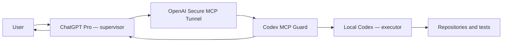

# ChatGPT Codex Bridge for Windows

> **ChatGPT Pro in the loop:** ChatGPT Pro supervises, Codex executes, and the
> bridge keeps repositories, Codex threads, progress, and results visible to
> both sides.

[](#windows-quick-start)
[](LICENSE)
[](https://github.com/larryppgg/chatgpt-codex-bridge)

[中文说明](README.zh-CN.md) · [Windows live proof](docs/WINDOWS_LIVE_PROOF.md) ·
[Security and release checklist](docs/GITHUB_RELEASE_CHECKLIST.zh-CN.md)

This repository is the tested Windows port and extended edition of
[`larryppgg/chatgpt-codex-bridge`](https://github.com/larryppgg/chatgpt-codex-bridge).
It preserves the upstream MIT history and architecture while adding a native
PowerShell 5.1 controller, durable Windows process handling, a global Codex
catalog, structured progress reports, and a verified ChatGPT-to-Windows round
trip.

> Note: a ZCode execution-provider port was started and then shelved on the
> [`zcode-port`](https://github.com/54xkeee/chatgpt-codex-bridge/tree/zcode-port)
> branch — dormant, unmaintained, end-to-end acceptance never run. Do not use it.

## Why ChatGPT Pro in the loop?

Codex is excellent at operating inside a repository. ChatGPT Pro is useful as
the supervising layer that keeps the wider objective, reviews progress, finds
the right existing repository or thread, and decides whether Codex should
continue, correct, test, or stop.



The intended loop is:

1. ChatGPT inspects known repositories, projects, Codex threads, and jobs.
2. ChatGPT selects an existing context or starts a bounded background job.
3. Codex implements, diagnoses, tests, or researches locally.
4. The bridge exposes live `phase`, `activity`, failure stage, and a structured
   terminal report.
5. ChatGPT reviews the evidence and continues the same Codex thread when more
   work remains.

The maintainer's subjective experience is that ChatGPT Pro often provides
stronger planning and review than using Codex 5.6 Sol at its highest setting by
itself. This is a workflow observation, not a controlled model benchmark.

## Durable status cards

These privacy-safe screenshots are rendered from the current Guard widget with
synthetic paths, job IDs, and results. They contain no device or account data.

### Codex working in the background


### Completed and ready for ChatGPT review


### Interrupted with an explicit recovery path


Regenerate a demo from the current Guard source:

```bash
python3 scripts/docs/render-widget-demo.py \
  --state completed \
  --output /tmp/codex-widget-demo.html
```

## What the Windows edition adds

- Native Windows PowerShell 5.1 install, status, doctor, restart, and uninstall.
- Per-user runtime under `%LOCALAPPDATA%\chatgpt-codex-bridge`.
- UTF-8 and non-ASCII Windows path support.
- Verified process-tree shutdown and MCP EOF handling.
- Retried atomic `status.json` replacement for Windows file contention.
- Runtime version and Guard SHA-256 drift detection.
- Global, bounded discovery of Codex projects, repositories, threads, history,
  and durable Bridge jobs.
- Signed project, repository, thread, job, and pagination capabilities instead
  of exposing reusable raw local identifiers.
- Structured progress and terminal reports designed for ChatGPT review.
- Compatibility with Codex CLI 0.147 through `thread/list`, `thread/read`, and
  `thread/turns/list`, with project grouping derived from thread `cwd`.

## Public MCP tools

### Execute and continue work

| Tool | Purpose |
|---|---|
| `codex` | Short diagnostic and initial synchronous thread |
| `codex-reply` | Short synchronous continuation |
| `codex-run` | Durable job in the existing configured workspace |
| `codex-start` | New isolated project plus durable Codex job |
| `codex-reply-async` | Durable continuation of the same signed Codex thread |
| `codex-wait` | Bounded wait until a job reaches a terminal state |
| `codex-job-open` | Reopen a durable job card |
| `codex-job-status` | Private widget polling endpoint |

### Let ChatGPT understand Codex first

| Tool | Purpose |
|---|---|
| `codex-overview` | Workspace, runtime fingerprint, and bounded counts |
| `codex-project-list` | Projects derived from current Codex metadata |
| `codex-repository-list` | Direct-child Git repositories, branches, and state |
| `codex-thread-list` | Recent Codex threads filtered by project or query |
| `codex-thread-read` | Bounded summarized turn history without reasoning text |
| `codex-job-list` | Durable jobs with progress and terminal reports |

Catalog scope is limited to the configured workspace root and its direct child
directories. It does not recursively inventory the entire machine.

## Windows quick start

### Requirements

- Windows 10 or 11.
- ChatGPT Pro with Developer Mode / custom MCP connections available.
- Codex desktop app and Codex CLI signed in and working.
- Python 3 and Windows PowerShell 5.1 or newer.
- OpenAI `tunnel-client`, a device Tunnel profile, and its control-plane key.
- A workspace container such as `D:\Work` whose direct children are projects.

### Install as a Codex plugin

```powershell
codex plugin marketplace add 54xkeee/chatgpt-codex-bridge `
  --ref windows-v0.6.1
codex plugin add chatgpt-codex-bridge@chatgpt-codex-bridge
```

Open a new Codex task so the controller Skill is loaded, then ask Codex:

```text
Install chatgpt-codex-bridge on Windows with profile chatgpt-codex,
workspace D:\Work, and preset personal-full-control. Run doctor afterwards.
```

### Install directly from source

```powershell
git clone https://github.com/54xkeee/chatgpt-codex-bridge.git
cd chatgpt-codex-bridge\plugins\chatgpt-codex-bridge

.\scripts\install-windows.ps1 `
  -Profile chatgpt-codex `
  -Workspace D:\Work `
  -Preset personal-full-control

.\scripts\doctor-windows.ps1
```

Daily operations:

```powershell
.\scripts\chatgpt-codex-bridge-windows.ps1 status
.\scripts\chatgpt-codex-bridge-windows.ps1 doctor
.\scripts\chatgpt-codex-bridge-windows.ps1 restart
.\scripts\chatgpt-codex-bridge-windows.ps1 stop
.\scripts\uninstall-windows.ps1
```

## Connect ChatGPT

1. Open ChatGPT Developer Mode and create a new custom plugin.
2. Choose **Tunnel** and select the device Tunnel used by the installer.
3. Select **Developer Mode** for the connection's operation policy.
4. Save it as `Codex MCP Guard` and verify all 14 tools above appear.
5. Choose **Use in chat**, start a new conversation, and attach the plugin.

A useful first message is:

```text
Use Codex MCP Guard. Call codex-overview, find the relevant repository and
recent Codex thread, inspect a bounded history page, then use codex-run or
codex-reply-async for the task. Keep calling codex-wait until completion and
review the structured report before answering me.
```

## Proven on Windows

The 2026-08-24 live acceptance run verified:

- ChatGPT Developer connection loaded all 14 tools.
- ChatGPT request reached Secure MCP Tunnel and the local Guard.
- Catalog found the target repository and 11 recent Codex threads.
- `codex-thread-read` returned a bounded three-turn page and a signed cursor.
- `codex-run` executed two read-only commands and moved through
  `executing -> finalizing -> completed`.
- The terminal report contained an outcome, summary, commands, and next step.
- The source Guard, packaged Guard, and installed runtime Guard had the same
  SHA-256.
- 55 Guard contract tests, the Windows PowerShell 5.1 suite, package checks,
  EOF cleanup, worker-tree revocation, and atomic status replacement passed.

See [the reproducible evidence record](docs/WINDOWS_LIVE_PROOF.md).

## Security model

The public repository contains code and tests, not a usable connection to the
maintainer's machine. Every installation supplies its own Tunnel profile,
ChatGPT connection, Codex login, workspace, and local capability key.

`personal-full-control` intentionally runs local Codex with
`danger-full-access` and no per-command prompt after the user attaches the
reviewed ChatGPT plugin. Use `workspace-safe` for a smaller execution surface.
Policy values are fixed by the local preset rather than accepted from the MCP
caller. Historical Codex content is returned as untrusted data, not controller
instructions.

Do not publish Tunnel IDs, control-plane keys, signed capabilities, raw thread
or job IDs, browser cookies, screenshots containing account details, or the
per-user runtime directory.

## Attribution and co-creation

- **Original project and architecture:**
  [@larryppgg](https://github.com/larryppgg), author of the upstream
  [`chatgpt-codex-bridge`](https://github.com/larryppgg/chatgpt-codex-bridge).
- **Windows port, global Codex catalog, progress contract, and live proof:**
  [@54xkeee](https://github.com/54xkeee), co-created through a
  ChatGPT-Pro-supervised Codex workflow.

The original Git history and MIT license are retained. See
[CONTRIBUTORS.md](CONTRIBUTORS.md) for the contribution boundary.

## Project status

The Windows path is live-tested on the maintainer's device. macOS remains the
upstream platform and is kept in the shared plugin. Linux service integration
is not implemented in this edition.

## License

[MIT](LICENSE), preserving the upstream copyright notice.
