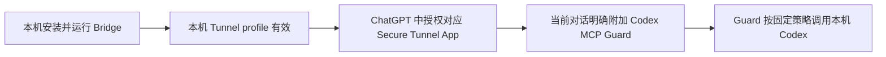
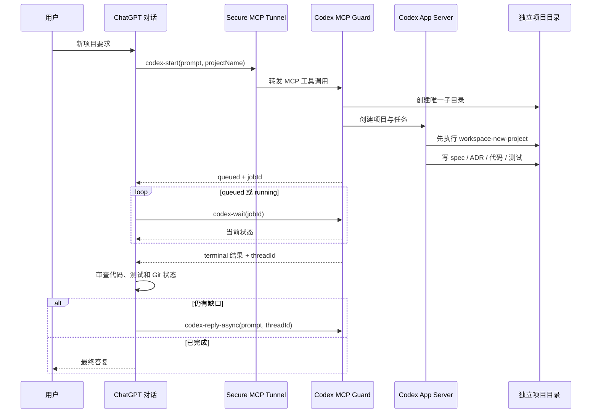
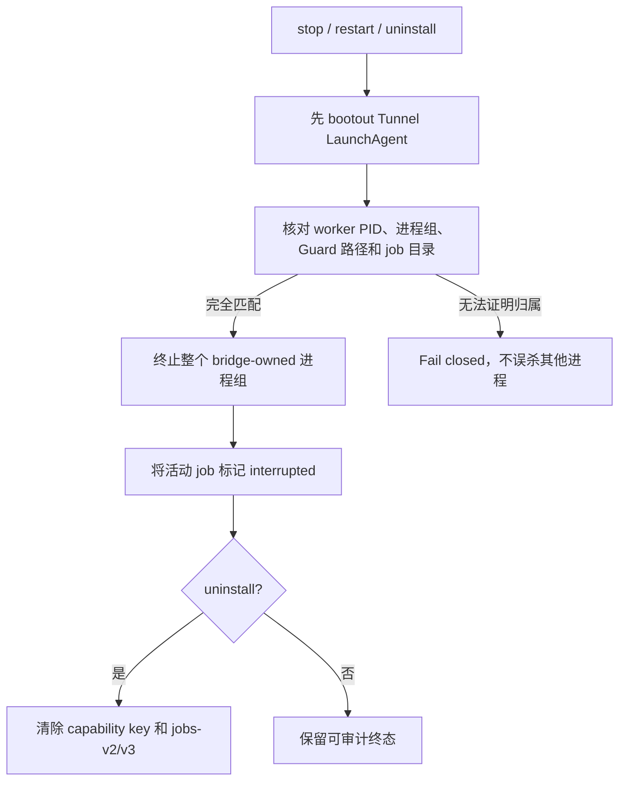

# ChatGPT Codex Bridge 中文说明

> 让 ChatGPT 网页对话通过 OpenAI Secure MCP Tunnel 调度本机 Codex，
> 同时把“代码仓库”“本机控制权”“ChatGPT 授权”明确分开。

## 先回答最重要的问题

**不会因为别人打开或克隆这个 GitHub 仓库，就能直接控制你家里的电脑。**

仓库只包含源代码、安装脚本、Skill、测试和说明，不包含以下任何一项：

- 你的 Tunnel profile 或 runtime key；
- 你的 ChatGPT Developer MCP 授权；
- 你的 Codex 登录；
- 本机能力签名密钥；
- 本机原始 Codex thread/job ID；
- 浏览器 Cookie、SSH key、Keychain 或生产环境变量。

必须同时满足下面四个条件，ChatGPT 才能向这台 Mac 发起调用：



缺少任何一环，都不能从仓库远程控制电脑。即使仓库公开，其他人也只
能获得安装包；他们必须在自己的设备上完成自己的 Codex 登录、Tunnel
配置和 ChatGPT 授权。

但要诚实说明：一旦你在自己的 Mac 上启用 `personal-full-control`，并在
ChatGPT 对话中附加、授权这个 App，这条链路就是按设计拥有很高权限：
`danger-full-access + approval-policy=never`。方便性来自你主动建立的本机
授权链，而不是 GitHub 仓库本身。

## 它实际怎么工作



新项目会得到独立目录，并通过 Codex App Server 注册为 Codex 桌面端可
识别的项目和任务。第一条项目指令显式携带 `workspace-new-project` Skill，
要求先初始化 `AGENTS.md`、README、spec、ADR、源码和项目记忆结构。

## 权限和撤权边界

### 两个固定预设

| 预设 | Sandbox | Approval | 用途 |
|---|---|---|---|
| `personal-full-control` | `danger-full-access` | `never` | 个人可信 Mac，优先方便 |
| `workspace-safe` | `workspace-write` | `on-request` | 共享或低信任工作区 |

MCP 调用方不能临时把 safe 预设改成 full control，也不能自行指定任意
`cwd`。每个公开 job/thread 标识都是本机签名的 bearer capability，并绑定：

- 当前安装的工作区根目录；
- sandbox；
- approval policy；
- 本机私有签名密钥。

升级、换工作区或换预设后，旧 capability 会失效。

### stop / restart / uninstall



- `stop`：停止 Tunnel，并撤销可证明属于 Bridge 的后台 Codex worker。
- `restart` / 重装：旧任务先撤销，再加载新 Guard，避免旧高权限任务残留。
- `uninstall`：进一步清除 Bridge 自己的 capability/job 状态。
- 不删除 Tunnel profile、项目仓库或 Codex 对话历史。
- 归属证明不完整时拒绝强杀，避免误伤机器上的其他进程。

## 安装

### 1. 前置条件

- macOS；
- 已登录且可运行的 Codex；
- Python 3；
- OpenAI 官方 `tunnel-client`；
- 本设备自己的 Tunnel profile；
- 已存在的 workspace 容器目录。

### 2. 安装固定版本

```zsh
codex plugin marketplace add larryppgg/chatgpt-codex-bridge \
  --ref chatgpt-codex-bridge-v0.6.1
codex plugin add chatgpt-codex-bridge@chatgpt-codex-bridge
```

插件安装完成后新开一个 Codex 任务，让 Skill 清单重新加载。进入插件根
目录后执行：

```zsh
/bin/zsh scripts/install-macos.zsh \
  --profile <本设备的-profile> \
  --workspace <绝对-workspace-目录> \
  --preset personal-full-control

/bin/zsh scripts/doctor.zsh
```

不要把别人的 Tunnel profile、凭据文件、Codex 登录或会话目录复制到新
设备。多设备应使用不同 App 名称，例如 `Codex Mac mini`、`Codex MacBook`。

### 3. ChatGPT 端

1. 打开 Developer Mode。
2. 创建或选择本设备对应的 Secure Tunnel App。
3. 审查工具及权限并授权。
4. 选择 **Use in chat / 在聊天中试用**。
5. 新建对话，确认输入框附近出现 `Codex MCP Guard` pill。
6. 再发送“使用 Codex 构建这个项目”。

插件安装成功不等于 ChatGPT App 已创建，也不等于当前对话已附加工具。

## 日常操作

```zsh
/bin/zsh scripts/chatgpt-codex-bridge.zsh status
/bin/zsh scripts/chatgpt-codex-bridge.zsh doctor
/bin/zsh scripts/chatgpt-codex-bridge.zsh restart
/bin/zsh scripts/chatgpt-codex-bridge.zsh stop
/bin/zsh scripts/uninstall-macos.zsh
```

长任务应使用：

- 新项目：`codex-start` → 重复 `codex-wait`；
- 同项目继续：`codex-reply-async` → 重复 `codex-wait`；
- 旧卡片恢复：`codex-job-open`，不要重复 `codex-start`；
- `codex` / `codex-reply` 只用于短诊断。

## 已踩过的坑

### 1. 旧对话不一定支持 Developer MCP

看到 `This conversation does not support developer MCPs` 时，不是本机 Codex
坏了。刷新 App 后新建对话，并确认 App pill 真正在当前对话里。

### 2. 手机上看得到 App，不等于能执行

“可见”只证明 UI 能显示连接器。必须看到真实 tool call、jobId 和终态，
才算调度成功。

### 3. 已安装但返回 0 个函数

常见原因是对话没有附加 App、ChatGPT 缓存旧 schema、Tunnel 未 ready，
或 Guard/插件版本漂移。依次做 `status`、`doctor`、刷新 App、新建对话。

### 4. `Failed to fetch template`

这是 Apps 模板/缓存/连接恢复问题，不代表应重新启动一个 Codex 项目。
先确认 Tunnel ready，重试卡片一次；仍失败时用同一个 `jobId` 调
`codex-job-open`。

### 5. `queued` 不是完成

`codex-start` 立即返回只是入队成功。必须继续 `codex-wait`，直到
`completed`、`failed` 或 `interrupted`，再审查代码和测试。

### 6. ChatGPT 不会永久在线，也没有零点击反向唤醒

Codex 可以在后台继续，但普通 ChatGPT 回合结束后，MCP 不能无条件向旧
对话主动发消息。Apps 卡片的“把结果发给 ChatGPT 审查”是明确点击的恢复
路径；它不是 24/7 的 unsolicited reverse push。

### 7. MCP thread 不自动等于 Codex 侧边栏任务

单纯运行 `codex mcp-server` 可能得到 threadId，但不保证 Codex 桌面侧边栏
出现项目。本 Bridge 使用 App Server 创建 project/task，并校验 projectId、
threadId、cwd 三者一致。

### 8. 不要在插件中加入 `.mcp.json`

Guard 服务对象是 ChatGPT Secure Tunnel。若让 Codex 自己把 Guard 当 MCP
客户端加载，会形成 `Codex → Guard → Codex` 递归或重复控制路径，也不会
替你完成 ChatGPT Developer Mode 授权。

### 9. v0.6.0 的安全缺口

- capability 只绑定安装密钥，没有绑定 workspace/preset；
- stop/uninstall 没有完整撤销 detached worker 进程组；
- Tunnel 验证脚本在 checksum/provenance 通过前执行候选二进制；
- Apps follow-up 可能把原始 Codex 文本拼成 user-role 消息；
- 同步工具缺少独立并发和截止时间边界。

v0.6.1 已修复；旧卡片/capability 不跨这个安全边界继续使用。公开
v0.6.0 已退出分发，不作为回滚版本；需要取证时只使用私有权威仓库。

### 10. “当前目录脱敏”不等于“Git 历史脱敏”

`rg`、sanitization test、Gitleaks 扫描当前树通过，只能证明当前树。准备公
开仓库时还必须检查全部提交、tag、作者邮箱、删除过的文件和 release
附件。不要把敏感字符串拆成多段后留在测试里——仍然是泄露。

### 11. 截图也会泄露

截图可能包含用户名、Tunnel/App 名称、对话 ID、项目路径、浏览器账号、
书签或通知。因此本 README 使用 Mermaid 可审计图，不提交真实账号截图。

## 发布前验证

```zsh
/usr/bin/python3 tests/bridge/test-codex-mcp-guard.py
/bin/zsh tests/bridge/test-verify-tunnel-client.zsh
/bin/zsh tests/portable/test-macos-installer.zsh
/bin/zsh tests/portable/test-public-sanitization.zsh
/bin/zsh tests/portable/test-plugin-package.zsh
```

如果有私有识别值，在仓库外创建只读 denylist，一行一个字符串：

```zsh
/bin/zsh scripts/release/check-public-sanitization.zsh \
  --repo "$PWD" \
  --denylist /absolute/private-denylist.txt
```

门禁只报告文件和行号，不打印 denylist 内容。完整发布标准见
[GitHub 发布脱敏清单](docs/GITHUB_RELEASE_CHECKLIST.zh-CN.md)。

## 平台和产品边界

- 当前服务封装只支持 macOS LaunchAgent；Windows/Linux 暂未实现。
- 这是 MIT 社区项目，不是 OpenAI 官方产品。
- 不提供 ChatGPT、Codex、Tunnel、GitHub 或设备凭据。
- 不承诺任何账号套餐一定开放 Developer MCP；以当前产品 UI 和真实工具
  调用为准。
- 不承诺普通 ChatGPT 对话关闭后能够零点击反向唤醒。
